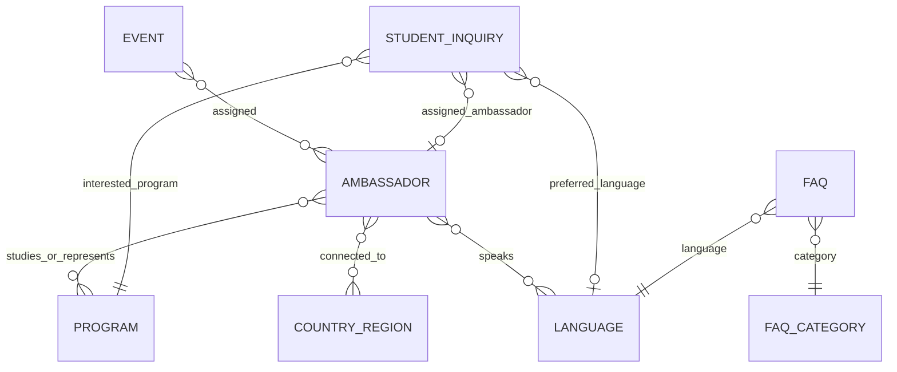

# ER Model

## Entity Fields

- Ambassador: name, photo, degree program, countries/regions, languages, bio, contact preference, availability, status.
- Program: program name, degree level, department, description, related ambassadors.
- Country/Region: name, related languages, related ambassadors.
- Language: name, ISO code, related ambassadors.
- Event: title, date/time, location or online link, description, assigned ambassadors, event type.
- Student Inquiry: student name, email, country, interested program, question/message, preferred language, assigned ambassador, status.
- FAQ: title, category, body/content, language, published status.
- FAQ Category: name, description, related FAQs.
